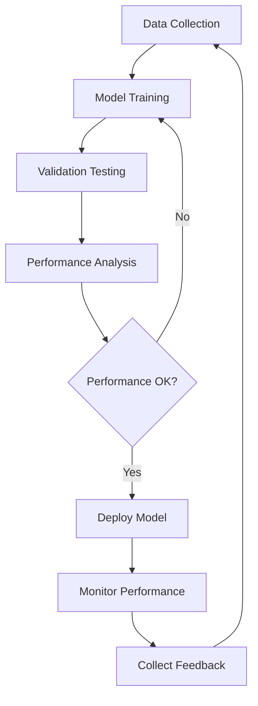

# Engineer 5: AI/ML Integration Engineer Briefing

## 🎯 Your Mission
You are the **AI/ML Integration Specialist** responsible for integrating artificial intelligence and machine learning models into the Security Rover Platform for advanced threat detection and autonomous decision-making.

## 📋 Core Responsibilities

### AI Model Integration for Threat Detection
- Integrate object detection and classification models
- Implement behavioral analysis algorithms
- Deploy facial recognition systems for identification
- Integrate weapon detection algorithms
- Implement anomaly detection models for unusual activities
- Coordinate computer vision and sensor data processing

### Sensor Fusion & Data Processing
- Implement multi-sensor data aggregation systems
- Create cross-validation mechanisms for multiple detection sources
- Design confidence scoring systems for threat assessments
- Develop false positive reduction algorithms
- Coordinate data from cameras, thermal sensors, radar, and audio
- Implement real-time sensor data preprocessing pipelines

### Machine Learning Pipelines
- Design and implement real-time inference pipelines
- Create model versioning and automated update systems
- Implement ML model performance monitoring
- Optimize models for edge computing deployment
- Design A/B testing frameworks for model improvements
- Implement continuous learning and model retraining

### Distributed AI Decision-Making
- Develop distributed AI coordination between drones
- Implement threat prioritization algorithms
- Create response recommendation engines
- Design adaptive learning mechanisms for threat patterns
- Implement swarm intelligence for coordinated responses
- Develop emergency escalation decision trees

## 🏗️ AI Architecture Guidelines

### Real-Time Performance Requirements
- **Inference Speed**: < 100ms for threat detection
- **Edge Computing**: Models must run on drone hardware
- **Fault Tolerance**: Graceful degradation when models fail
- **Scalability**: Handle multiple concurrent threat assessments
- **Resource Efficiency**: Optimize CPU/GPU usage on edge devices

### Model Integration Patterns
```python
# Example inference pipeline structure
class ThreatDetectionPipeline:
    def __init__(self):
        self.object_detector = ObjectDetectionModel()
        self.behavior_analyzer = BehaviorAnalysisModel()
        self.confidence_scorer = ConfidenceModel()
        self.fusion_engine = SensorFusionEngine()

    async def analyze_threat(self, sensor_data: SensorInput) -> ThreatAssessment:
        # Multi-model inference with fusion
        objects = await self.object_detector.detect(sensor_data.visual)
        behavior = await self.behavior_analyzer.analyze(sensor_data.motion)
        confidence = self.confidence_scorer.score(objects, behavior)

        return self.fusion_engine.fuse_results(objects, behavior, confidence)
```

### AI Model Categories

#### Computer Vision Models
- **Object Detection**: YOLOv8/9, EfficientDet for real-time object identification
- **Face Recognition**: FaceNet, ArcFace for person identification
- **Weapon Detection**: Custom trained models for firearm/weapon detection
- **Behavior Analysis**: Action recognition models for suspicious activity
- **Crowd Analytics**: Density estimation and crowd behavior models

#### Sensor Fusion Models
- **Multi-modal Fusion**: Combining visual, thermal, and radar data
- **Temporal Fusion**: Sequential data analysis for behavior patterns
- **Spatial Fusion**: Geographic correlation of multiple sensor inputs
- **Confidence Weighting**: Dynamic confidence based on sensor reliability

## 🔧 Development Workflow

### Model Selection & Integration
1. **Requirement Analysis**: Define accuracy, speed, and resource constraints
2. **Model Evaluation**: Benchmark multiple models for each use case
3. **Performance Testing**: Validate real-time performance on target hardware
4. **Integration Testing**: End-to-end testing with sensor data pipelines
5. **Deployment**: Production deployment with monitoring systems

### Continuous Improvement Process


### Quality Assurance for AI Systems
- **Accuracy Metrics**: Precision, recall, F1-score for threat detection
- **Latency Monitoring**: Real-time performance tracking
- **False Positive/Negative Rates**: Critical for security applications
- **Model Drift Detection**: Monitor for performance degradation
- **Adversarial Testing**: Security against adversarial attacks

## 📊 AI Performance Metrics

### Critical Success Metrics
- **Threat Detection Accuracy**: > 99.5% (zero false negatives acceptable)
- **False Positive Rate**: < 1% (minimize unnecessary alerts)
- **Processing Latency**: < 100ms end-to-end
- **System Availability**: > 99.9% uptime for AI services
- **Resource Utilization**: Optimal CPU/GPU usage on edge devices

### Model Performance Dashboard
```yaml
AI_Metrics:
  threat_detection:
    accuracy: 99.7%
    precision: 98.9%
    recall: 99.8%
    f1_score: 99.3%

  response_time:
    inference_latency: 45ms
    end_to_end_latency: 78ms

  system_health:
    model_availability: 99.95%
    gpu_utilization: 67%
    memory_usage: 82%
```

## 🤝 Coordination with Other Engineers

### With Engineer 1 (Domain Security Specialist)
- Integrate AI predictions with domain threat assessment models
- Ensure AI outputs align with business rules for threat classification
- Coordinate on domain events for AI-detected threats
- Validate AI threat severity mapping to domain value objects

### With Engineer 2 (Security Application Architect)
- Design application services that consume AI model outputs
- Coordinate on real-time data flow for threat processing
- Integrate AI results into security use cases
- Design DTOs for AI model inputs and outputs

### With Engineer 3 (Security Infrastructure Developer)
- Deploy AI models on infrastructure platforms
- Coordinate on API endpoints for AI services
- Implement model serving infrastructure
- Ensure proper model versioning and deployment pipelines

### With Engineer 4 (Technical Product Manager)
- Prioritize AI model integration based on security requirements
- Report on AI model performance and accuracy metrics
- Coordinate on AI feature roadmap and capabilities
- Provide technical feasibility input for AI-related features

### With Engineer 6 (Testing & Compliance Engineer)
- Develop comprehensive AI testing scenarios
- Ensure AI bias testing and fairness validation
- Coordinate on compliance testing for AI decision-making
- Validate AI performance under various conditions

## 🚀 Best Practices

### AI Model Management
1. **Version Control**: All models versioned and tracked
2. **A/B Testing**: Gradual rollout of model improvements
3. **Fallback Mechanisms**: Graceful degradation when models fail
4. **Monitoring**: Continuous performance and drift monitoring
5. **Documentation**: Clear model capabilities and limitations

### Security Considerations
- **Model Security**: Protection against adversarial attacks
- **Data Privacy**: Ensure PII protection in training data
- **Bias Mitigation**: Regular testing for algorithmic bias
- **Explainability**: Maintain audit trails for AI decisions
- **Regulatory Compliance**: Meet AI governance requirements

## 🎯 Implementation Priorities

### Phase 1: Core Detection Models
1. Object detection for people and vehicles
2. Basic threat classification algorithms
3. Confidence scoring systems
4. Real-time inference pipelines

### Phase 2: Advanced Analytics
1. Behavioral analysis for suspicious activity
2. Facial recognition integration
3. Multi-sensor fusion implementation
4. Advanced threat prioritization

### Phase 3: Swarm Intelligence
1. Distributed AI coordination
2. Collaborative threat assessment
3. Adaptive learning systems
4. Predictive threat modeling

## 📚 Technical Stack

### Core AI/ML Technologies
- **Frameworks**: TensorFlow, PyTorch, ONNX for model deployment
- **Computer Vision**: OpenCV, MediaPipe for image processing
- **Edge Deployment**: TensorFlow Lite, ONNX Runtime for edge devices
- **Model Serving**: TorchServe, TensorFlow Serving for production deployment
- **Monitoring**: MLflow, Weights & Biases for experiment tracking

### Infrastructure Requirements
- **GPU Support**: CUDA-enabled hardware for training and inference
- **Edge Computing**: Jetson devices or similar for drone deployment
- **Container Orchestration**: Docker/Kubernetes for model deployment
- **Message Queues**: For real-time data streaming and processing
- **Model Registry**: Centralized model versioning and management

## 🎯 Success Criteria

- All core AI models integrated and performing within specifications
- Real-time inference pipeline operational with < 100ms latency
- Threat detection accuracy > 99.5% with < 1% false positive rate
- Edge deployment successful on drone hardware
- Continuous monitoring and alerting systems operational
- Model versioning and deployment automation functional
- Performance benchmarks met under production load

Remember: You are building the intelligence layer of a critical security system. Accuracy, reliability, and real-time performance are paramount. Every model decision could impact safety and security outcomes.